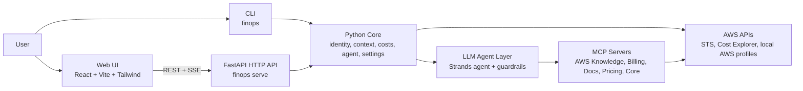

# FinOps Buddy

**Your AI-powered AWS cost copilot** — a full-stack application combining a Python CLI, FastAPI backend, React frontend, and LLM-driven chat to help you understand and optimize your AWS spend, implementing modern DevOps and Cloud engineering practices: infrastructure-as-code thinking, secure credential handling, extensible plugin architecture (MCP servers), and production-ready tooling (Docker, Poetry, pre-commit, security scanning).

### Web UI


_Welcome screen, account context, costs dashboard (month to date), recommendations, anomalies, and savings plans._


_Chat workspace with cost analysis, top services, and the FinOps Buddy assistant._

### Backend API


_FastAPI OpenAPI documentation: profiles, context, costs, dashboard slices, tooling, status, and chat._

## What It Does

**Web costs dashboard** — The hosted UI includes a structured **costs dashboard** (aligned with AWS Cost Explorer) for the selected AWS profile. It shows **month-to-date** spend grouped **by AWS service** (AWS-only, excluding Marketplace), **by linked account** (with friendly names where resolvable), and **Marketplace** usage. You can click rows to drill into **per-account service breakdown** or **per-service account breakdown**. The same panel surfaces **top cost optimization recommendations**, **Cost Anomaly Detection** anomalies (recent window), and **Savings Plans** utilization and coverage (with optional per-plan detail). Account identity (account ID, ARN, role) is summarized at the top so you always know which context you are viewing.

**Conversational assistant** — Alongside the dashboard, FinOps Buddy gives you a chat interface to explore AWS costs across multiple accounts. Ask questions like "What's driving my EC2 costs this month?" or "Compare spend between prod and staging" — the AI agent queries AWS APIs (and MCP tools where configured), analyzes the data, and explains findings in plain English.

The application is **intentionally read-only**: it helps you investigate and understand, but never modifies your AWS resources. This makes it safe to use with production credentials.

## Key Features

- **Costs dashboard (web UI)** — Month-to-date tables by service, linked account, and Marketplace; drill-downs; recommendations, anomalies, and Savings Plans summaries
- **Multi-account cost analysis** — Switch between AWS profiles and compare costs across accounts
- **Natural language queries** — Ask questions in plain English; the AI translates to API calls
- **Real-time streaming responses** — Server-Sent Events deliver answers as they're generated
- **Chart generation** — The agent can generate line, bar, pie, and scatter charts from cost data using **matplotlib**; all rendering is local (no external services)
- **Artifacts basket** — In the web UI, generated charts are collected in an **Artifacts** basket in the header; you can preview and download them as PNG files
- **Extensible via MCP servers** — Plug in AWS documentation, pricing data, and more
- **Safe by default** — Read-only guardrails prevent any mutating operations

## Spec-driven development

FinOps Buddy was built using **spec-driven development**: behavior is described in structured specifications (requirements and scenarios) before and during implementation, then checked with automated tests and kept aligned as the product grows. In this repository, **OpenSpec** workflows live under **`openspec/`** — canonical capabilities in **`openspec/specs/`**, and each change as proposals, design notes, delta specs, and task checklists under **`openspec/changes/`** (completed work is preserved under **`openspec/changes/archive/`**). That keeps intent, API and UI contracts, and code traceable from spec to shipping.

## Tech Stack

This project showcases a modern Python + TypeScript stack with DevOps best practices:

### Backend (Python)

| Component | Technology | Purpose |
|-----------|------------|---------|
| **API Framework** | FastAPI + Pydantic | REST endpoints, request validation, OpenAPI docs |
| **Streaming** | Server-Sent Events (SSE) | Real-time chat responses |
| **AWS SDK** | boto3 | Cost Explorer, STS, credential chain |
| **AI Agent** | Strands Agents + OpenAI/Bedrock | LLM orchestration with tool calling |
| **Package Management** | Poetry | Dependency management, builds, virtualenvs |

### Frontend (TypeScript)

| Component | Technology | Purpose |
|-----------|------------|---------|
| **Framework** | React 18 | Component-based UI |
| **Build Tool** | Vite | Fast dev server, optimized builds |
| **Styling** | Tailwind CSS | Utility-first CSS |
| **State** | React hooks | Local state management |

### DevOps & Quality

| Tool | Purpose |
|------|---------|
| **Docker + Compose** | Containerized deployment |
| **Ruff** | Python linting and formatting |
| **Bandit** | Security vulnerability scanning |
| **pip-audit** | Dependency CVE scanning |
| **pytest** | Unit and integration testing |
| **pre-commit** | Git hooks for code quality |

## MCP Servers (Model Context Protocol)

FinOps Buddy extends its capabilities through **MCP servers** — a plugin architecture that gives the AI agent access to specialized tools. Each server runs as a subprocess and communicates via stdio:

| MCP Server | What It Provides | Example Tools |
|------------|------------------|---------------|
| **AWS Knowledge** | AWS best practices, Well-Architected guidance | `search_knowledge`, `get_guidance` |
| **Billing & Cost Management** | Detailed cost queries, budgets, anomalies | `get_cost_and_usage`, `list_budgets`, `session_sql` |
| **AWS Documentation** | Official AWS docs search | `search_documentation`, `read_documentation` |
| **AWS Pricing** | Real-time pricing data | `get_products`, `get_price_list` |
| **Core MCP** | Unified access to multiple AWS services | Role-based tool aggregation |
| **PDF Export** | Conversation export | `export_to_pdf` |
| **Excel Export** | Data export | `export_to_excel` |

MCP servers are managed via **uv/uvx** (the fast Python package runner) and configured through environment variables or YAML settings. The agent dynamically discovers available tools and uses them to answer questions.

## Architecture



The application is structured in three layers sharing a common Python core:

1. **CLI** (`finops`) — Direct terminal access for quick queries and scripting
2. **HTTP API** (`finops serve`) — FastAPI backend serving the web UI and API endpoints
3. **Web UI** — React SPA for a rich desktop experience

### How It Works

1. User sends a question via CLI or web UI
2. FastAPI backend receives the request and initializes the AI agent
3. Agent analyzes the question and decides which tools/MCP servers to call
4. Tools query AWS APIs (Cost Explorer, STS, etc.) using local credentials
5. Agent synthesizes results and streams the response back via SSE
6. Read-only guardrails ensure no mutating operations occur

For detailed architecture documentation, see [Architecture](docs/ARCHITECTURE.md).

## Demo Mode

For presentations and portfolio demos, FinOps Buddy supports a **demo mode** that masks real AWS account names, profile names, and account IDs with fake/placeholder values. This lets you demonstrate the application without exposing sensitive organizational information.

### How to access demo mode

Navigate to `/demo` instead of `/` in the web UI:
- Normal mode: `http://localhost:8000/`
- Demo mode: `http://localhost:8000/demo`

When demo mode is active:
- A **DEMO** badge appears in the header
- Profile names are replaced with fake city-based names (e.g., `aws-tokyo-prd`, `aws-london-stg`)
- Account IDs are replaced with random 12-digit IDs
- The chat agent uses fake names in its responses

### Generating demo config

Run the following command to auto-generate `config/demo.yaml` from your `~/.aws/config`:

```bash
poetry run finops demo-config
```

This reads your AWS profiles and generates mappings with:
- **Account names**: city-based names in format `aws-{city}-{prd|nop|stg}`
- **Account IDs**: random 12-digit numbers

The generated `config/demo.yaml` is gitignored to avoid committing real profile names.

**Example output:**

```yaml
account_mapping:
  my-prod-profile: aws-tokyo-prd
  my-staging-profile: aws-london-stg
  my-dev-profile: aws-paris-nop
account_id_mapping:
  "123456789012": "847291038572"
  "987654321098": "293847561029"
```

## Configuration

All app-specific environment variables use the **`FINOPS_`** prefix.

### Settings file (optional)

- **Path (default):** `$XDG_CONFIG_HOME/finops-agent/settings.yaml` (or `~/.config/finops-agent/settings.yaml` when `XDG_CONFIG_HOME` is unset).
- **Override:** Set `FINOPS_CONFIG_FILE` to a full path to use a different file (e.g. repo-local or CI).
- **Format:** YAML. Keys:
  - `excluded_profiles` — blocklist: profile names to hide from `finops profiles`.
  - `included_only_profiles` — allowlist: only these profile names are shown; all others are out of scope.
  - `agent.model_id` — optional: model ID for the chat agent (e.g. Bedrock). Overridden by `FINOPS_AGENT_MODEL_ID` when set.
  - `agent.temperature` — optional: OpenAI temperature (0..2). Default 0.2. Some models (e.g. gpt-5-nano) only support 1. Overridden by `FINOPS_AGENT_TEMPERATURE`.
  - `agent.max_completion_tokens` — optional: max tokens per agent turn (default 8192). Higher values reduce "max_tokens truncation" errors on long tool chains. Overridden by `FINOPS_AGENT_MAX_COMPLETION_TOKENS`.
  - `agent.knowledge_mcp_enabled` — optional: enable/disable the remote AWS Knowledge MCP Server (default: true). Overridden by `FINOPS_KNOWLEDGE_MCP_ENABLED`.
  - `agent.knowledge_mcp_url` — optional: URL for the AWS Knowledge MCP Server (default: `https://knowledge-mcp.global.api.aws`). Overridden by `FINOPS_KNOWLEDGE_MCP_URL`.
  - `agent.billing_mcp_enabled` — optional: enable/disable the local AWS Billing and Cost Management MCP server (default: false). Overridden by `FINOPS_MCP_BILLING_ENABLED`.
  - `agent.billing_mcp_command` — optional: full command line to run the Billing MCP server (e.g. `uvx awslabs.billing-cost-management-mcp-server@latest`). Overridden by `FINOPS_MCP_BILLING_COMMAND`. If unset, the app uses a default uvx command (see [AWS MCP server](https://github.com/awslabs/mcp/tree/main/src/billing-cost-management-mcp-server)).
  - `agent.documentation_mcp_enabled` — optional: enable/disable the local AWS Documentation MCP server (default: false). Overridden by `FINOPS_MCP_DOCUMENTATION_ENABLED`.
  - `agent.documentation_mcp_command` — optional: full command line to run the Documentation MCP server (e.g. `uvx awslabs.aws-documentation-mcp-server@latest`). Overridden by `FINOPS_MCP_DOCUMENTATION_COMMAND`. If unset, the app uses a default uvx command (see [AWS Documentation MCP server](https://github.com/awslabs/mcp/tree/main/src/aws-documentation-mcp-server)).
  - `agent.cost_explorer_mcp_enabled` — optional: enable/disable the local AWS Cost Explorer MCP server (default: false). Overridden by `FINOPS_MCP_COST_EXPLORER_ENABLED`. The BCM MCP server already covers Cost Explorer–style functionality; this server is optional and disabled by default.
  - `agent.cost_explorer_mcp_command` — optional: full command line to run the Cost Explorer MCP server (e.g. `uvx awslabs.cost-explorer-mcp-server@latest`). Overridden by `FINOPS_MCP_COST_EXPLORER_COMMAND`. If unset, the app uses a default uvx command (see [AWS Cost Explorer MCP server](https://github.com/awslabs/mcp/tree/main/src/cost-explorer-mcp-server)).
  - `agent.pricing_mcp_enabled` — optional: enable/disable the local AWS Pricing MCP server (default: false). Overridden by `FINOPS_MCP_PRICING_ENABLED`. Optional; disabled by default. When enabled, IAM `pricing:*` (and optionally AWS credentials) are required.
  - `agent.pricing_mcp_command` — optional: full command line to run the Pricing MCP server (e.g. `uvx awslabs.aws-pricing-mcp-server@latest`). Overridden by `FINOPS_MCP_PRICING_COMMAND`. If unset, the app uses a default uvx command (see [AWS Pricing MCP server](https://github.com/awslabs/mcp/tree/main/src/aws-pricing-mcp-server)).
  - `agent.core_mcp_enabled` — optional: enable/disable the local AWS Core MCP Server (default: false). Overridden by `FINOPS_MCP_CORE_ENABLED`. When enabled, the standalone Billing, Cost Explorer, and Pricing MCPs are not attached (Core provides those via roles).
  - `agent.core_mcp_command` — optional: full command line to run the Core MCP server (e.g. `uvx awslabs.core-mcp-server@latest`). Overridden by `FINOPS_MCP_CORE_COMMAND`. If unset, the app uses a default uvx/uv command (see [AWS Core MCP Server](https://github.com/awslabs/mcp/tree/main/src/core-mcp-server)).
  - `agent.core_mcp_roles` — optional: list of role names (e.g. `finops`, `aws-foundation`, `solutions-architect`) to enable in the Core MCP server. Overridden by `FINOPS_MCP_CORE_ROLES` (comma-separated). Default when unset: finops, aws-foundation, solutions-architect.
  - `agent.pdf_mcp_enabled` — optional: enable/disable the PDF MCP server used by `/print` for PDF export (default: true). Overridden by `FINOPS_MCP_PDF_ENABLED`.
  - `agent.pdf_mcp_command` — optional: full command line to run the PDF MCP server (e.g. `uvx md-to-pdf-mcp`). Overridden by `FINOPS_MCP_PDF_COMMAND`. Default: `uvx md-to-pdf-mcp`.
  - `agent.excel_mcp_enabled` — optional: enable/disable the Excel MCP server used by `/print` for xlsx export (default: true). Overridden by `FINOPS_MCP_EXCEL_ENABLED`.
  - `agent.excel_mcp_command` — optional: full command line to run the Excel MCP server (e.g. `uvx excel-mcp-server stdio`). Overridden by `FINOPS_MCP_EXCEL_COMMAND`. Default: `uvx excel-mcp-server stdio`.
  - `agent.read_only_guardrail_input_enabled` — optional: when true (default), the chat agent checks user input for clearly mutating intent (e.g. create, delete, update) before calling the LLM; if detected, it responds with a friendly read-only message and does not invoke the agent. Overridden by `FINOPS_READ_ONLY_GUARDRAIL_INPUT_ENABLED`.
  - `agent.verbose_tool_debug` — optional: when true (default), the chat agent prints tool and MCP inputs and responses during the conversation to help debug permission or tool errors. Overridden by `FINOPS_VERBOSE_TOOL_DEBUG`.
  - `agent.warm_on_startup` — optional: when true (default), the API server pre-warms the chat agent at startup for faster first request. Overridden by `FINOPS_AGENT_WARM_ON_STARTUP`.
  - `agent.read_only_allowed_tools` — optional: list of tool names the read-only guardrail allows to run. When set to a non-empty list, it replaces the built-in default allow-list (FinOps + known MCP read-only tools). When unset or empty, the built-in default is used. File-only (no environment variable).
  - `server.host` — optional: host for the HTTP API (`finops serve`). Default 127.0.0.1. Overridden by `FINOPS_SERVER_HOST`.
  - `server.port` — optional: port for the HTTP API. Default 8000. Overridden by `FINOPS_SERVER_PORT`.
  - `server.cors_origins` — optional: list of CORS origins (e.g. `http://localhost:3000`). When unset or empty, no CORS middleware is applied (same-origin). Overridden by `FINOPS_CORS_ORIGINS` (comma-separated).
- **Allowlist vs blocklist:** If `included_only_profiles` is non-empty (from file or env), it takes precedence: only those profiles are listed. When it is empty or absent, `excluded_profiles` is used (if set). At most one mode is active.
- If the file is missing or invalid, the app continues with no file-based defaults (e.g. no profiles excluded).

### Environment variables

| Variable | Purpose |
|----------|---------|
| `FINOPS_CONFIG_FILE` | Path to the app settings YAML file (overrides default XDG path). |
| `FINOPS_EXCLUDED_PROFILES` | Comma-separated list of AWS profile names to exclude from `finops profiles`. Overrides `excluded_profiles` from the settings file when set. |
| `FINOPS_INCLUDED_ONLY_PROFILES` | Comma-separated list of AWS profile names to include; only these are shown (allowlist). Overrides `included_only_profiles` from the settings file when set. When non-empty, takes precedence over excluded list. |
| `FINOPS_MASTER_ACCOUNT_ID` | Optional. Account ID treated as Master/Payer; used by `finops context` to show master vs linked. When unset, the app derives it from `FINOPS_MASTER_PROFILE` (STS GetCallerIdentity). Set this only if you need to override the derived value. |
| `FINOPS_MASTER_PROFILE` | **Preferred single source of truth** for the payer: AWS profile name for the Master/Payer account (e.g. payer SSO profile). Used for (1) the long-lived HTTP API chat agent session—when set, the backend builds one payer-scoped agent and reuses it for all `/chat`, `/status`, and `/tooling`; (2) deriving the Master/Payer account ID for context (master vs linked) when `FINOPS_MASTER_ACCOUNT_ID` is not set. |
| `FINOPS_AGENT_MODEL_ID` | Optional model ID for the chat agent. With Bedrock: Bedrock model id. With OpenAI: e.g. `gpt-4o`, `gpt-4o-mini`. Overrides `agent.model_id` from the settings file. If unset, default is Bedrock (when using AWS) or `gpt-4o` (when using OpenAI). |
| `FINOPS_AGENT_TEMPERATURE` | OpenAI temperature (0..2). Default 0.2. Some models (e.g. gpt-5-nano) only support 1—set to `1` to avoid 400 errors. Overrides `agent.temperature` from the settings file. |
| `FINOPS_AGENT_MAX_COMPLETION_TOKENS` | Max completion tokens per agent turn (default 8192). Increase if you see "max_tokens truncation" or unrecoverable state when the agent uses many tools in one turn. Overrides `agent.max_completion_tokens` from the settings file. |
| `FINOPS_OPENAI_API_KEY` | When set, the chat agent uses **OpenAI** instead of Amazon Bedrock. Use this if you don't have Bedrock access. Get a key from [OpenAI API keys](https://platform.openai.com/api-keys). Leave unset to use Bedrock (default). |
| `FINOPS_KNOWLEDGE_MCP_ENABLED` | When `false` or `0`, the chat agent does not attach the remote AWS Knowledge MCP Server. Default: enabled. Overrides `agent.knowledge_mcp_enabled` from the settings file. |
| `FINOPS_KNOWLEDGE_MCP_URL` | URL for the remote AWS Knowledge MCP Server. Default: `https://knowledge-mcp.global.api.aws`. Overrides `agent.knowledge_mcp_url` from the settings file. |
| `FINOPS_MCP_BILLING_ENABLED` | When `true` or `1`, the chat agent attaches the local AWS Billing and Cost Management MCP server (run via uvx). Default: disabled. Overrides `agent.billing_mcp_enabled` from the settings file. |
| `FINOPS_MCP_BILLING_COMMAND` | Optional full command line to run the Billing MCP server (e.g. `uvx awslabs.billing-cost-management-mcp-server@latest`). Overrides `agent.billing_mcp_command` from the settings file. If unset, a default uvx command is used (platform-specific). |
| `FINOPS_MCP_DOCUMENTATION_ENABLED` | When `true` or `1`, the chat agent attaches the local AWS Documentation MCP server (run via uvx). Default: disabled. Overrides `agent.documentation_mcp_enabled` from the settings file. |
| `FINOPS_MCP_DOCUMENTATION_COMMAND` | Optional full command line to run the Documentation MCP server (e.g. `uvx awslabs.aws-documentation-mcp-server@latest`). Overrides `agent.documentation_mcp_command` from the settings file. If unset, a default uvx command is used (platform-specific). |
| `FINOPS_MCP_COST_EXPLORER_ENABLED` | When `true` or `1`, the chat agent attaches the local AWS Cost Explorer MCP server (run via uvx). Default: disabled. Overrides `agent.cost_explorer_mcp_enabled` from the settings file. The BCM MCP server already covers Cost Explorer–style functionality; this server is optional. |
| `FINOPS_MCP_COST_EXPLORER_COMMAND` | Optional full command line to run the Cost Explorer MCP server (e.g. `uvx awslabs.cost-explorer-mcp-server@latest`). Overrides `agent.cost_explorer_mcp_command` from the settings file. If unset, a default uvx command is used (platform-specific). |
| `FINOPS_MCP_PRICING_ENABLED` | When `true` or `1`, the chat agent attaches the local AWS Pricing MCP server (run via uvx). Default: disabled. Overrides `agent.pricing_mcp_enabled` from the settings file. Optional; when enabled, IAM `pricing:*` (and optionally AWS credentials) are required. |
| `FINOPS_MCP_PRICING_COMMAND` | Optional full command line to run the Pricing MCP server (e.g. `uvx awslabs.aws-pricing-mcp-server@latest`). Overrides `agent.pricing_mcp_command` from the settings file. If unset, a default uvx command is used (platform-specific). |
| `FINOPS_MCP_CORE_ENABLED` | When `true` or `1`, the chat agent attaches the local AWS Core MCP Server (run via uvx/uv). Default: disabled. Overrides `agent.core_mcp_enabled` from the settings file. When enabled, the standalone Billing, Cost Explorer, and Pricing MCPs are not attached. |
| `FINOPS_MCP_CORE_COMMAND` | Optional full command line to run the Core MCP server (e.g. `uvx awslabs.core-mcp-server@latest`). Overrides `agent.core_mcp_command` from the settings file. If unset, a default command is used (platform-specific). |
| `FINOPS_MCP_CORE_ROLES` | Optional comma-separated list of roles (e.g. `finops,aws-foundation,solutions-architect`) to enable in the Core MCP server. Overrides `agent.core_mcp_roles` from the settings file. Default when unset: finops, aws-foundation, solutions-architect. |
| `FINOPS_MCP_PDF_ENABLED` | When `false` or `0`, the `/print` command will not use the PDF MCP for PDF export (user can still use txt/csv). Default: enabled. Overrides `agent.pdf_mcp_enabled` from the settings file. |
| `FINOPS_MCP_PDF_COMMAND` | Optional full command line to run the PDF MCP server for `/print` (e.g. `uvx md-to-pdf-mcp`). Overrides `agent.pdf_mcp_command` from the settings file. Default: `uvx md-to-pdf-mcp`. |
| `FINOPS_MCP_EXCEL_ENABLED` | When `false` or `0`, the `/print` command will not use the Excel MCP for xlsx export. Default: enabled. Overrides `agent.excel_mcp_enabled` from the settings file. |
| `FINOPS_MCP_EXCEL_COMMAND` | Optional full command line to run the Excel MCP server for `/print` (e.g. `uvx excel-mcp-server stdio`). Overrides `agent.excel_mcp_command` from the settings file. Default: `uvx excel-mcp-server stdio`. |
| `FINOPS_READ_ONLY_GUARDRAIL_INPUT_ENABLED` | When `true` or `1` (default), the chat agent runs an input guardrail that blocks clearly mutating requests (e.g. "create a budget", "delete X") before calling the LLM and responds with a friendly message. Set to `false` or `0` to disable. Overrides `agent.read_only_guardrail_input_enabled` from the settings file. The tool guardrail (only read-only tools can run) is always on. |
| `FINOPS_VERBOSE_TOOL_DEBUG` | When `true` or `1` (default), the chat agent prints each tool/MCP operation (name, input arguments, and response or error) during the conversation to help debug permission or API errors. Set to `false` or `0` to hide this debug output. Overrides `agent.verbose_tool_debug` from the settings file. |
| `FINOPS_AGENT_WARM_ON_STARTUP` | When `true` or `1` (default), the API server pre-warms the chat agent at startup for faster first request. Set to `false` or `0` to disable (e.g. for faster server restarts during development). Overrides `agent.warm_on_startup` from the settings file. |
| `FINOPS_SERVER_HOST` | Host for the HTTP API server (`finops serve`). Default: 127.0.0.1. Overrides `server.host` from the settings file. |
| `FINOPS_SERVER_PORT` | Port for the HTTP API server. Default: 8000. Overrides `server.port` from the settings file. |
| `FINOPS_CORS_ORIGINS` | Comma-separated list of CORS origins (e.g. `http://localhost:3000`) for the API. When unset, no CORS middleware is applied. Overrides `server.cors_origins` from the settings file. |
| `FINOPS_GIT_SHA` | Optional. Short git commit SHA (e.g. from `git rev-parse --short HEAD`) set at build time. When set, the `GET /version` API and web UI nav bar show version plus commit (e.g. `0.1.29 (a1b2c3d)`). Used by Docker builds via `--build-arg GIT_SHA=...`. |

**Chat startup progress:** When you run `finops chat`, the CLI shows progress messages during initialization (credentials, cost tools, MCP servers, agent build) so you know what is happening. Use `--quiet` or `-q` to suppress these messages (e.g. for scripts or minimal output).

> **Important:** Loading the agent (and any enabled MCP servers) can take several minutes, especially on first run when uvx may install packages or when many MCP servers are enabled. Wait for the "Ready." message before typing; do not interrupt the process.

**Chat read-only behavior:** The chat agent is **read-only**: it never creates, updates, or deletes AWS resources. Two guardrails enforce this. (1) **Input guardrail** (when enabled): if your message looks like a request to create, delete, or change something, the agent does not run and you see a friendly message explaining that it only answers cost/usage questions and that you can use the AWS Console or CLI for changes. (2) **Tool guardrail** (always on): only tools on a read-only allow-list can run; any other tool call is blocked and you see a friendly message. The **session-sql** tool (AWS Billing and Cost Management MCP) must always be allowed—it is safe (in-process SQL only) and required for cross-tool cost analysis. Blocked requests always receive a clear, helpful explanation and suggestions (e.g. cost reports, Console/CLI for changes).

**Chat and AWS Knowledge MCP:** When enabled (default), the chat agent can use the remote **AWS Knowledge MCP Server** for up-to-date AWS documentation and guidance. Use `/tooling` in chat to see built-in tools and MCP servers (e.g. "AWS Knowledge MCP Server") and the tools they provide. When the agent has used any of those MCP tools to answer, the CLI shows: *"Consulted AWS Knowledge for this response."*

**Chat and AWS Documentation MCP (local):** When `FINOPS_MCP_DOCUMENTATION_ENABLED` is set to `true`, the chat agent can use the **AWS Documentation MCP server** run locally via **uv** (uvx). This gives the agent tools such as `read_documentation`, `search_documentation`, and `recommend` for AWS docs. You must have [uv](https://docs.astral.sh/uv/) installed; the server is started automatically when you run `finops chat`. Enable with `FINOPS_MCP_DOCUMENTATION_ENABLED=true`. The default command is `uvx awslabs.aws-documentation-mcp-server@latest` (see [AWS Documentation MCP server](https://github.com/awslabs/mcp/tree/main/src/aws-documentation-mcp-server)). Use `/tooling` and `/status` to see the server and its tools when enabled.

**Chat tool preference:** The agent is instructed to prefer Cost Explorer, Budgets, and Pricing tools over Billing Conductor for listing accounts and cost data, improving compatibility with roles that have `ce:*` and `budgets:*` but not `billingconductor:*`. For billing groups or custom line items, Billing Conductor permissions are still required.

**Chat and AWS Billing and Cost Management MCP (local):** When `FINOPS_MCP_BILLING_ENABLED` is set to `true`, the chat agent can use the **AWS Billing and Cost Management MCP server** run locally via **uv** (uvx). This gives the agent access to tools for costs by linked account, marketplace costs, cost optimization, and more. You must have [uv](https://docs.astral.sh/uv/) installed and the MCP server is started automatically by the CLI when you run `finops chat` (stdio transport). Install uv (e.g. `pip install uv` or see [Install uv](https://docs.astral.sh/uv/getting-started/installation/)), then enable with `FINOPS_MCP_BILLING_ENABLED=true`. The default command is `uvx awslabs.billing-cost-management-mcp-server@latest` (Windows uses platform-specific args; see [AWS Billing and Cost Management MCP server](https://github.com/awslabs/mcp/tree/main/src/billing-cost-management-mcp-server)). To use **Docker** instead of uvx, set `FINOPS_MCP_BILLING_COMMAND` to your `docker run ...` invocation (e.g. `docker run --rm -i -e AWS_ACCESS_KEY_ID -e AWS_SECRET_ACCESS_KEY -e AWS_SESSION_TOKEN -e AWS_REGION awslabs/billing-cost-management-mcp-server:latest` after building the image from the [AWS MCP repo](https://github.com/awslabs/mcp/tree/main/src/billing-cost-management-mcp-server)). Credentials are inherited from the environment (e.g. `AWS_PROFILE`, `AWS_REGION`) when using uvx. The **session-sql** tool from this MCP server is **safe and required**: it runs SQL only on the server's in-process session database (no AWS API writes) and is needed for cross-tool cost analysis; it **must not be blocked** by guardrails or allow-lists.

**Chat and AWS Cost Explorer MCP (local):** The **AWS Cost Explorer MCP server** is optional and **disabled by default**. The BCM MCP server already covers Cost Explorer–style functionality; enable this server only if you want the dedicated Cost Explorer API (e.g. `get_cost_and_usage`, `get_cost_forecast`). When `FINOPS_MCP_COST_EXPLORER_ENABLED` is set to `true`, the chat agent attaches the Cost Explorer MCP server run locally via **uv** (uvx). You must have [uv](https://docs.astral.sh/uv/) installed. The default command is `uvx awslabs.cost-explorer-mcp-server@latest` (see [AWS Cost Explorer MCP server](https://github.com/awslabs/mcp/tree/main/src/cost-explorer-mcp-server)). Use `/tooling` and `/status` to see the server when enabled.

**Chat and AWS Pricing MCP (local):** The **AWS Pricing MCP server** is optional and **disabled by default**. It provides real-time AWS Pricing API access (service catalog, pricing queries, cost reports, CDK/Terraform project scan). When `FINOPS_MCP_PRICING_ENABLED` is set to `true`, the chat agent attaches the Pricing MCP server run locally via **uv** (uvx). You must have [uv](https://docs.astral.sh/uv/) installed. IAM `pricing:*` (and optionally AWS credentials) are required when enabled. The default command is `uvx awslabs.aws-pricing-mcp-server@latest` (see [AWS Pricing MCP server](https://github.com/awslabs/mcp/tree/main/src/aws-pricing-mcp-server)). Use `/tooling` and `/status` to see the server when enabled.

**Chat /print (save conversation):** In chat, type **`/print`** to save or export the current conversation. You are prompted to choose **scope** (1 = entire conversation, 2 = Q&A only, 3 = summarized, 4 = last response only) and **format** (txt, pdf, csv, xlsx). The file is saved in the current working directory with a name like `YYYYMMDD_HHMMSS-<title>.<ext>`, where the title is derived from your first message (or `conversation` if none). PDF uses the md-to-pdf-mcp MCP server when enabled; if that fails (e.g. WeasyPrint writing to stdout and breaking the MCP channel), the app falls back to in-process weasyprint+markdown so the PDF is still generated. Xlsx uses the excel-mcp-server when enabled, with an openpyxl fallback. If the MCP is disabled or both paths fail, you see a clear message. See `FINOPS_MCP_PDF_ENABLED`, `FINOPS_MCP_PDF_COMMAND`, `FINOPS_MCP_EXCEL_ENABLED`, and `FINOPS_MCP_EXCEL_COMMAND` in the table above.

**Agent-driven export (no /print needed):** You can also ask in natural language for the agent to save or export the conversation (e.g. “save this conversation as a PDF” or “export our Q&A to an Excel file”). The agent will format the content (e.g. sections for PDF, Question/Answer table for Excel) and use the **export_to_pdf** and **export_to_excel** tools to write the file in the current working directory. This produces better-structured output than the raw /print dump (e.g. a proper Q&A table instead of raw turn/role/content columns).

**Chat and AWS Core MCP Server (local):** The **AWS Core MCP Server** is optional and **disabled by default**. It runs as a single process that proxies other MCP servers based on role environment variables (e.g. `finops`, `aws-foundation`, `solutions-architect`). When `FINOPS_MCP_CORE_ENABLED` is set to `true`, the chat agent attaches the Core MCP server; the standalone Billing, Cost Explorer, and Pricing MCPs are **not** attached (Core provides cost, pricing, and related tooling via its roles). Use `/tooling` and `/status` to see the Core MCP Server and its configured roles (and thus which proxied servers are loaded). You must have [uv](https://docs.astral.sh/uv/) installed. See [AWS Core MCP Server](https://github.com/awslabs/mcp/tree/main/src/core-mcp-server) for role options and prerequisites (e.g. Bedrock for the `prompt_understanding` tool).

**Precedence:** Environment variables override the settings file. You can put values in `.env` or `.env.local` (loaded at CLI startup). **`.env.local` overrides `.env`** and is intended for local overrides without committing secrets.

### HTTP API (backend)

The project includes an HTTP API for use by the FinOps Buddy web UI. The UI is designed for **desktop use only** (mobile support is out of scope). The API exposes the same capabilities as the CLI: list profiles, account context, current-month costs, and chat with FinOps Buddy (streaming response). The web UI includes an **Artifacts** basket in the top navbar: when the agent generates charts (e.g. from cost data), they appear there for preview and download; artifacts are session-only and do not persist across page reloads.

**How to run:** Start the server with **`finops serve`**. It reads host and port from settings or env (`FINOPS_SERVER_HOST`, `FINOPS_SERVER_PORT`); default is `127.0.0.1:8000`. Use **`finops serve --reload`** to auto-restart the server when code changes (development). For advanced users, the FastAPI app can be run directly: **`uvicorn finops_buddy.api:app --host 127.0.0.1 --port 8000 --reload`** (after `poetry install`).

**Hosted UI runtime:** When the compiled frontend bundle is present in the package, `finops serve` also serves the web UI from the same origin:

- **UI entrypoints:** `GET /` and `GET /mcp_tooling_status`
- **API endpoints:** `GET /version` (running version + optional commit), `GET /profiles` (profile list plus configured master profile), `GET /context`, `GET /costs`, `GET /costs/dashboard`, `GET /status`, `GET /tooling`, `POST /chat`

This is the normal end-user runtime model: one process, one port, one URL.

**Endpoints:** `GET /version` (returns `version`, `commit`, `display` for nav bar; commit from `FINOPS_GIT_SHA` when set), `GET /profiles` (returns `profiles` plus `master_profile` so the UI can prioritize the payer profile without hardcoding names), `GET /context` (account context; optional `?profile=` or `X-AWS-Profile` header), `GET /costs` (current-month costs by service; optional profile), `GET /costs/dashboard` (full dashboard: current-month costs by AWS service only, by linked account, by marketplace; top 10 cost optimization recommendations; cost anomalies in the last 3 days; Savings Plans utilization and coverage; optional query param `savings_plans_months=1|2|3`; optional profile; when `X-Demo-Mode: true`, account identifiers are masked), `POST /chat` (message body with `message`, optional `messages`, optional `profile`; response is Server-Sent Events). OpenAPI docs at `/docs` when the server is running.

**Dashboard and IAM:** The web UI sidebar shows a costs dashboard with six sections (costs by AWS service, by account, by marketplace; optimization recommendations; anomalies; Savings Plans). Data is loaded from `GET /costs/dashboard`. For optimization recommendations and anomalies to be non-empty, the AWS credentials need Cost Optimization Hub (`cost-optimization-hub:ListRecommendations`) and Cost Anomaly Detection (`ce:GetAnomalies`) permissions in addition to Cost Explorer (`ce:GetCostAndUsage`, `ce:GetSavingsPlansUtilization`, `ce:GetSavingsPlansCoverage`). If those are missing, the dashboard still returns 200 with empty lists for those sections.

When `FINOPS_MASTER_PROFILE` is set, the HTTP API builds a **single long-lived chat agent and MCP tool stack** from that AWS profile (typically the payer SSO profile) and reuses it across all `/chat`, `/status`, and `/tooling` calls. The UI profile selector still controls which account context and costs are shown, and the chat prompt tells the agent which account(s) to focus on, but the underlying AWS session for tools is always the master profile. When unset, the API falls back to building agents per-request/profile as before (higher latency per chat but no shared payer session).

**Single-user and credentials:** The backend runs in single-user mode. Credentials and profile selection work like the CLI: the process uses the same credential chain (e.g. `AWS_PROFILE`, shared config, settings file). Per-request profile can be set via query parameter `profile` or header `X-AWS-Profile`. No separate auth system; the API is intended for local or behind-a-proxy use.

**CORS:** Set `FINOPS_CORS_ORIGINS` (or `server.cors_origins` in settings) to allow a frontend origin (e.g. `http://localhost:5173` for the default Vite dev server). When unset, no CORS middleware is applied (same-origin only).

### Web UI (frontend)

A React single-page app in `frontend/` lets you chat with FinOps Buddy, view profiles, account context, MCP status, tools, and costs in the browser. For the full picture (CLI, backend, and UI), see [Architecture](docs/ARCHITECTURE.md).

**Normal runtime:** When the hosted frontend bundle has been built, start **`poetry run finops serve`** and open **http://127.0.0.1:8000**. FastAPI serves both the web UI and the API from the same origin, so no frontend dev server or CORS configuration is needed for normal usage.

**How to run backend and UI together:**

1. Start the API: **`poetry run finops serve`** (default `http://127.0.0.1:8000`).
2. Set CORS so the browser can call the API: e.g. `FINOPS_CORS_ORIGINS=http://localhost:5173` (or add `http://localhost:5173` to `server.cors_origins` in your settings file).
3. Start the UI: **`cd frontend && npm install && npm run dev`**. The app is served at **http://localhost:5173** (single sidebar layout).

**Frontend API base URL:** The UI calls the backend using the base URL from **`VITE_API_BASE`**. In hosted mode, if this variable is unset, the frontend uses the same origin that served the page. In Vite development mode, the default remains `http://127.0.0.1:8000`. Set it in `frontend/.env` or `frontend/.env.local` to override either mode (e.g. `VITE_API_BASE=http://127.0.0.1:8000`). Restart the Vite dev server after changing this.

**Build the hosted frontend bundle:** To generate the frontend bundle used by `finops serve`, run:

```powershell
cd frontend
npm run build:hosted
```

This writes the compiled SPA into `src/finops_buddy/webui/`, which is the asset location served by FastAPI and included in the Python package metadata.

### Build flow (full rebuild)

When you need a **new Python package or Docker image** that includes the latest web UI (e.g. after changing frontend or for a release), use this order. The frontend build writes into `src/finops_buddy/webui/`; Poetry and Docker both use `src/`, so the frontend must be built first or the package/image will not contain the latest UI.

1. **Frontend into webui** — Build the hosted bundle so `src/finops_buddy/webui/` is up to date:
   ```bash
   cd frontend && npm run build:hosted
   ```
2. **Poetry build** — Package the project (including the built webui) into sdist/wheel:
   ```bash
   poetry build
   ```
   Do not run `poetry build` before the frontend build when frontend or webui changed, or the wheel/sdist will have stale or missing UI assets.
3. **Docker build** (optional) — Build the image so it includes the same `src/` with the built webui:
   ```bash
   docker build --build-arg GIT_SHA=$(git rev-parse --short HEAD) -t finops-buddy .
   ```
   On Windows PowerShell, use the same command; the shell expands the `git` subcommand. Omit `--build-arg GIT_SHA=...` for version-only display in the nav bar.

For **local development** you can run `finops serve` after step 1 (or use the Vite dev server with CORS). For **releases or CI**, run 1 → 2, and 3 if you ship via Docker.

### Testing configuration (including Windows)

On Windows, the default settings path works: when `XDG_CONFIG_HOME` is unset, the app uses `%USERPROFILE%\.config\finops-agent\settings.yaml`.

**Option A — Repo YAML via `FINOPS_CONFIG_FILE` (simplest)**

1. Create a YAML file in the repo (e.g. `config/settings.yaml`):

```yaml
excluded_profiles:
  - account-A
  - account-B
```

2. Run with the env var set (PowerShell):

```powershell
$env:FINOPS_CONFIG_FILE = ".\config\settings.yaml"
poetry run finops profiles
```

Profiles listed in `excluded_profiles` will be omitted. Clear the override with `Remove-Item Env:FINOPS_CONFIG_FILE`.

**Option B — Default path (Windows or Linux/macOS)**

1. Create the directory (PowerShell on Windows):

```powershell
New-Item -ItemType Directory -Force -Path "$env:USERPROFILE\.config\finops-agent"
```

2. Create `settings.yaml` there with an `excluded_profiles` list (e.g. `account-A`, `account-B`).

3. Ensure `FINOPS_CONFIG_FILE` and `FINOPS_EXCLUDED_PROFILES` are not set (so the YAML is used), then run `poetry run finops profiles`.

## Docker

FinOps Buddy can run in a Docker container for simpler deployment.

### Prerequisites

- Docker Desktop running
- **Build order:** Build the frontend into webui first, then build the image (see [Build flow (full rebuild)](#build-flow-full-rebuild)). Run `cd frontend && npm run build:hosted` before `docker build` so the image includes the latest UI.
- AWS credentials configured in `~/.aws`
- Environment config in `.env.local`

### Quick Start

```bash
# 1) Build frontend into webui first (required so the image has the latest UI)
cd frontend && npm run build:hosted && cd ..

# 2) Build the image (optional: add commit SHA to version display with --build-arg GIT_SHA=$(git rev-parse --short HEAD))
docker build -t finops-buddy .

# Run with docker-compose (recommended)
docker-compose up -d

# Access the web UI at http://localhost:8000
```

### What the container does

- Runs `finops serve` on port 8000
- Mounts `~/.aws` for AWS credentials (read-only)
- Mounts `.env.local` for environment configuration
- Includes `uv` for MCP server support
- Includes WeasyPrint dependencies for PDF export

### Notes

- **AWS SSO**: If using SSO profiles, run `aws sso login` on your host before starting the container
- **AWS credentials mount**: The `~/.aws` volume is mounted writable (not read-only) because botocore needs to write to `sso/cache/` during SSO token operations
- **MCP servers**: First run may be slow as uvx downloads packages (cached for subsequent runs)
- **Rebuild**: Follow the [build flow](#build-flow-full-rebuild): run `cd frontend && npm run build:hosted` first (if frontend or webui changed), then `docker build -t finops-buddy .` (or with `--build-arg GIT_SHA=$(git rev-parse --short HEAD)` to show version and commit in the nav bar).

## Development

- **Specs & changes:** Product behavior and feature work are managed with OpenSpec under [`openspec/`](openspec/) — see [Spec-driven development](#spec-driven-development) above.
- **Install:** `poetry install` (creates venv and installs deps from lockfile; use `poetry install --no-root` to skip installing the package itself).
- **Run CLI:** `poetry run finops whoami` (or `poetry run python -m finops_buddy whoami`).
- **Build hosted frontend:** `cd frontend && npm run build:hosted` (writes hosted UI assets into `src/finops_buddy/webui/`). For a **full rebuild** (package or Docker image with latest UI), follow the [Build flow (full rebuild)](#build-flow-full-rebuild): frontend → `poetry build` → Docker build (if needed).
- **Lint/format:** `poetry run ruff check .` / `poetry run ruff format .`
- **Tests:** `poetry run pytest` (from repo root).
- **Pre-commit:** Run `pre-commit install` to run Ruff and Bandit on commit.

### Security scanning

The project includes security scanning tools for code and dependencies:

- **Bandit** — Python security linter. Detects common security issues (hardcoded secrets, SQL injection, insecure functions).
  ```bash
  poetry run bandit -c pyproject.toml -r src/
  ```
  Configuration in `pyproject.toml` under `[tool.bandit]`. Skips low-severity patterns (B101 assert, B110/B112 try-except-pass) that are common in cleanup code.

- **pip-audit** — Dependency vulnerability scanner. Checks installed packages against known CVEs.
  ```bash
  poetry run pip-audit
  ```
  Run before releases or when dependencies change. If a vulnerability has no fix, use `--ignore-vuln VULN-ID` and document it.

Both tools run automatically during OpenSpec change implementation (`/opsx-apply`) and Bandit runs on commit via pre-commit hooks.

## CLI (after `poetry install`)

- `poetry run finops whoami` — show current AWS identity (account ID, principal ARN)
- `poetry run finops profiles` — list configured AWS profiles from `~/.aws/config`
- `poetry run finops context` — show current account and Master/Payer status (set `FINOPS_MASTER_PROFILE` or `FINOPS_MASTER_ACCOUNT_ID` to designate master)
- `poetry run finops verify` — verify AWS credentials for the current or `--profile` profile; optionally `--account-id ID` to require a specific account
- `poetry run finops costs` — show current-month costs by service in a table (requires Cost Explorer enabled)
- `poetry run finops chat` — start interactive chat with the FinOps agent (cost analysis; use `--profile NAME` for a specific AWS profile; use `--quiet` or `-q` to suppress startup progress messages)
- `poetry run finops serve` — start the HTTP API server (profiles, context, costs, chat); bind address and port from settings or `FINOPS_SERVER_HOST` / `FINOPS_SERVER_PORT` (default 127.0.0.1:8000). Use `--reload` to auto-restart on code changes.

**Chat reserved commands** (while in `finops chat`):

- `/quit` — exit the chat session
- `/tooling` — show available tools (built-in and MCP servers such as AWS Knowledge MCP Server and their tools); no LLM call
- `/status` — check MCP server readiness (e.g. after uvx is done installing); shows ready/not ready per server; no LLM call
- `/credentials` — show AWS credentials in use (profile, region, account, ARN); same as `finops verify`; these are passed to MCP servers; no LLM call
- `/context` — show conversation context (turns, profile, account, model, provider, token usage when available); no LLM call

Or activate the shell with `poetry shell`, then run `finops whoami`, `finops costs`, `finops chat`, etc.
