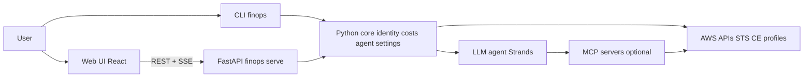

# FinOps Buddy

**AI-powered AWS cost copilot** — a read-only FinOps assistant that combines a **Python CLI**, **FastAPI** backend, **React** web UI, and **LLM-driven chat** so you can explore spend, dashboards, and recommendations without mutating your AWS estate.


---

## Purpose and scope

- **Purpose:** Make AWS cost and usage data easy to explore (tables, dashboard, natural language) with guardrails suited to production credentials.
- **Scope:** **Read-only** — no create/update/delete of AWS resources; input and tool-level guardrails enforce that stance.
- **Who it’s for:** Engineers and FinOps practitioners who already use AWS profiles (CLI/SSO) and want a desktop-friendly UI plus a scriptable CLI.

**Not in scope:** Mobile-first UI; multi-tenant SaaS (see [cloud deployment docs](docs/DEPLOY_AWS_ARCHITECTURE.md) for proposed internal multi-user hosting).

---

## Value

| You get | How |
|--------|-----|
| **Costs dashboard** | Month-to-date by service, account, Marketplace; recommendations, anomalies, Savings Plans (see [Features](docs/FEATURES.md)) |
| **Conversational analysis** | Ask in plain English; agent uses AWS APIs and optional [MCP servers](docs/MCP.md) |
| **Safe operations** | Read-only tool allow-list + optional input guardrail |
| **Same-origin web app** | Built UI served from FastAPI when you run `finops serve` — simple packaging, no CORS for the default path |
| **Traceable evolution** | [OpenSpec](docs/DEVELOPMENT.md#spec-driven-development) specs and change archives under `openspec/` |

---

## Tech stack

| Layer | Technologies |
|-------|----------------|
| **Backend** | Python, FastAPI, Pydantic, boto3, Strands Agents (OpenAI / Bedrock), Poetry |
| **Frontend** | React 18, Vite, Tailwind CSS |
| **Quality** | Ruff, Bandit, pip-audit, pytest, pre-commit |
| **Containers** | Docker, docker-compose; frontend build embedded under `src/finops_buddy/webui/` for releases |

---

## Architecture (high level)



More detail: **[Architecture](docs/ARCHITECTURE.md)** · Proposed **AWS** hosting: **[Deploy on AWS](docs/DEPLOY_AWS_ARCHITECTURE.md)** · **[Suggested OpenSpec order](docs/CLOUD_CHANGES_WORK_ORDER.md)** for cloud hardening workstreams.

---

## Quick start

```bash
poetry install
poetry run finops serve
```

Open **http://127.0.0.1:8000** (default bind). Ensure [AWS credentials](https://docs.aws.amazon.com/cli/latest/userguide/cli-chap-configure.html) are available (e.g. `~/.aws`, `AWS_PROFILE`).

**CLI examples:** `poetry run finops profiles` · `poetry run finops costs` · `poetry run finops chat`

**Full documentation:** **[docs/README.md](docs/README.md)** — configuration, running, Docker, development, MCP, features, demo mode.

---

## Documentation index

| Doc | Use when you need… |
|-----|---------------------|
| [docs/README.md](docs/README.md) | Index of all docs |
| [docs/FEATURES.md](docs/FEATURES.md) | UI screenshots, dashboard & chat, demo mode |
| [docs/CONFIGURATION.md](docs/CONFIGURATION.md) | `settings.yaml`, every `FINOPS_*` variable, chat/MCP behavior |
| [docs/RUNNING.md](docs/RUNNING.md) | API & UI, Vite dev, full rebuild, Docker, Windows settings |
| [docs/DEVELOPMENT.md](docs/DEVELOPMENT.md) | OpenSpec workflow, lint/test, CLI & `/commands` in chat |
| [docs/MCP.md](docs/MCP.md) | MCP server overview |
| [config/settings.yaml](config/settings.yaml) | Commented template (safe placeholders) |

---

## License and package

Project metadata and packaging: **`pyproject.toml`** (`finops-buddy`). Entry points: `finops` CLI, `finops serve` for the API + hosted UI.
