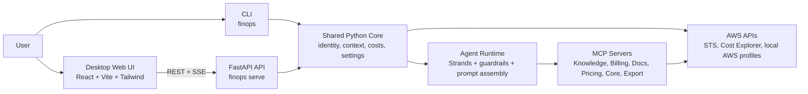

# FinOps Buddy — System Architecture

This document describes the current FinOps Buddy architecture: the CLI, the local HTTP API, the desktop web UI, and the shared Python core that connects them to AWS and optional MCP servers.

FinOps Buddy is designed as a **single-user, desktop-first, read-only** application. The backend runs on the same machine as the user, reuses the local AWS credential chain, and exposes both terminal and browser experiences over the same core services.

## High-level diagram



## Runtime view

```text
┌────────────────────────────────────────────────────────────────────────────┐
│ User                                                                      │
│  - CLI usage (`finops chat`, `finops costs`, `finops context`)            │
│  - Desktop browser usage (`/`, `/mcp_tooling_status`)                     │
└────────────────────────────────────────────────────────────────────────────┘
                 │ terminal                          │ HTTP / SSE
                 ▼                                   ▼
┌──────────────────────────────┐       ┌─────────────────────────────────────┐
│ CLI (`finops`)               │       │ Web UI (`frontend/`)               │
│ - profiles                   │       │ - Chat workspace                   │
│ - context                    │       │ - Account context + costs panel    │
│ - costs                      │       │ - MCP/tooling status page          │
│ - chat                       │       │ - Progress / heartbeat updates     │
└──────────────┬───────────────┘       └────────────────┬────────────────────┘
               │                                        │
               └──────────────────────┬─────────────────┘
                                      ▼
┌────────────────────────────────────────────────────────────────────────────┐
│ Shared Python core (`finops_buddy`)                                       │
│ - identity / profile resolution                                           │
│ - account context                                                         │
│ - cost retrieval                                                          │
│ - settings and env handling                                               │
│ - agent build / MCP wiring / caches                                       │
└────────────────────────────────┬───────────────────────────────────────────┘
                                 ▼
┌────────────────────────────────────────────────────────────────────────────┐
│ FastAPI backend (`finops serve`)                                          │
│ GET /profiles  GET /context  GET /costs  GET /status  GET /tooling        │
│ POST /chat (SSE: progress, message, done, error)                          │
└────────────────────────────────┬───────────────────────────────────────────┘
                                 ▼
┌────────────────────────────────────────────────────────────────────────────┐
│ AWS + MCP ecosystem                                                       │
│ - local AWS profiles / SSO / shared config                                │
│ - STS, Cost Explorer, pricing and other AWS APIs                          │
│ - MCP servers run locally or remotely depending on configuration          │
└────────────────────────────────────────────────────────────────────────────┘
```

## Runtime modes

FinOps Buddy intentionally supports two runtime shapes:

### Development mode

```text
Browser -> Vite dev server (frontend)
Browser -> FastAPI backend (API)
```

- Frontend development uses the Vite dev server from `frontend/`.
- The browser talks cross-origin to `finops serve`, so CORS must allow the frontend origin.
- This mode is optimized for fast UI iteration.

### Hosted runtime mode

```text
Browser -> FastAPI backend
           ├─ "/" and "/mcp_tooling_status" -> compiled SPA entrypoint
           ├─ "/assets/*" and root asset files -> compiled frontend assets
           └─ API endpoints -> profiles, context, costs, status, tooling, chat
```

- End users run only `finops serve`.
- FastAPI serves both the compiled web UI and the API from the same origin.
- No Vite process or CORS configuration is required for normal local usage.
- The compiled frontend bundle is generated from `frontend/` and copied into `src/finops_buddy/webui/` for hosted serving and packaging.

## Main components

| Component | Responsibility |
|-----------|----------------|
| **CLI** | Direct terminal experience for profile listing, account context, current-month costs, and interactive chat. No HTTP layer involved. |
| **FastAPI backend (`finops serve`)** | Local HTTP surface for the web UI. Exposes profiles, context, costs, agent/tool readiness, and streaming chat responses. |
| **React/Vite frontend** | Desktop SPA with profile selection, left-side account/cost panels, chat workspace, and dedicated `/mcp_tooling_status` screen. |
| **Shared Python core** | Central implementation for AWS identity, account context, cost retrieval, settings, agent assembly, caching, and MCP attachment. |
| **Agent runtime** | Strands-based read-only chat runtime that formats markdown responses, enforces guardrails, and invokes built-in or MCP-backed tools. |
| **MCP layer** | Optional integrations for AWS knowledge, billing/cost management, documentation, pricing, core AWS tooling, PDF, and Excel export. |

## Technologies in use

| Area | Technologies |
|------|--------------|
| **Frontend** | React, Vite, Tailwind CSS, Fetch API, Server-Sent Events |
| **Backend** | FastAPI, Pydantic, Python threading + queues for SSE progress streaming |
| **AWS integration** | boto3, STS, Cost Explorer, local AWS profile/config files |
| **Agent** | Strands agent framework, read-only tool guardrails, markdown-oriented prompt design |
| **Tool ecosystem** | MCP servers via `uv` / `uvx`, optional remote knowledge MCP |
| **Quality** | Ruff, pytest |

## Request and data flow

### CLI flow

1. The user runs a CLI command such as `finops context`, `finops costs`, or `finops chat`.
2. The CLI calls the shared Python core directly.
3. The core resolves the AWS profile and credentials, then talks to AWS APIs and/or MCP-backed tools.
4. Results are rendered back to the terminal.

### Web UI flow

1. The browser loads the SPA from either the Vite dev server (development) or the FastAPI-hosted compiled bundle (hosted runtime).
2. The user selects an AWS profile in the UI.
3. The frontend calls:
   - `GET /profiles`
   - `GET /context`
   - `GET /costs`
   - optionally `GET /status` and `GET /tooling`
4. When the user sends a chat message, the frontend calls `POST /chat`.
5. The backend returns a Server-Sent Events stream with:
   - `progress` events for early activity and tool progress
   - heartbeat updates while the request is still running
   - final `message`, `done`, or `error`
6. The frontend renders markdown replies and incremental status cues to keep the user informed.

## Profile and credential model

- FinOps Buddy does **not** manage credentials itself.
- It uses the local AWS credential chain: environment variables, shared config, shared credentials, SSO sessions, and selected profiles.
- The web UI never stores AWS credentials; it only sends the selected profile name to the local backend.
- `FINOPS_MASTER_PROFILE` is the preferred single source of truth for the payer/master profile.

### Master profile behavior

When `FINOPS_MASTER_PROFILE` is set:

- the API can reuse a **single long-lived agent/tool session** for chat-related routes
- the selected UI profile still controls account context and cost views
- the agent prompt can focus analysis on the selected account/profile while using the payer session underneath

This reduces repeated agent/tool initialization cost and fits the app’s single-user local model.

## Caching and performance behavior

The current implementation includes several performance-oriented behaviors:

- **Agent/tool caching**: cached agent/tool stacks are reused for the master profile
- **Per-request progress callback agent wrapper**: chat requests can still emit live progress even when tools are cached
- **Cost caching in the UI**: current-day current-month cost results are cached in memory on the frontend
- **Profile/account mapping cache**: profile-to-account mapping is cached with TTL
- **Non-blocking mapping warm-up**: when that mapping is cold, it can warm in the background instead of blocking chat
- **Fast mapping resolution order**:
  1. local AWS config parsing (`sso_account_id`, `role_arn`)
  2. payer Cost Explorer linked-account discovery
  3. STS fallback only for unresolved profiles

## Development topology

In development, FinOps Buddy normally runs as two local processes:

- **Frontend origin**: `http://localhost:5173` from Vite
- **Backend origin**: `http://127.0.0.1:8000` from `finops serve`

Because those origins differ, CORS must allow the frontend origin:

- `FINOPS_CORS_ORIGINS=http://localhost:5173`
- or `server.cors_origins` in the YAML settings file

## Hosted runtime topology

In normal local usage, FinOps Buddy can run as a single local process:

- **App origin**: `http://127.0.0.1:8000` from `finops serve`
- **Served by FastAPI**:
  - compiled SPA entrypoints (`/`, `/mcp_tooling_status`)
  - compiled frontend assets (`/assets/*` and root asset files such as `vite.svg`)
  - backend API routes (`/profiles`, `/context`, `/costs`, `/status`, `/tooling`, `/chat`)

This topology is the basis for packaging and distribution because the user only needs one server process and one URL.

## Production / deployment notes

The project does not require one fixed production topology. Common options include:

- serving the SPA and API behind the same reverse proxy
- serving them separately with CORS enabled
- keeping the current local-only single-user model for desktop use

The important invariant is that the frontend only needs an API base URL and the backend remains the holder of AWS credential resolution and tool execution.

## Related documents

- [README](../README.md)
