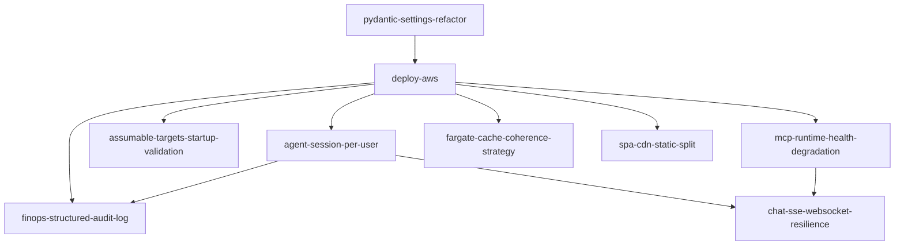

# OpenSpec work order — cloud / multi-user track

This document suggests **in which order to apply** related OpenSpec changes for a **rock-solid multi-user cloud deployment**. It is guidance only: adjust for your team capacity, compliance deadlines, and risk appetite.

**Active changes in scope (repository paths: `openspec/changes/<name>/`):**

| Change | Focus |
|--------|--------|
| `deploy-aws` | ECS, ALB+WAF+OIDC, cloud identity, trusted proxy auth, Bedrock, IaC/docs |
| `agent-session-per-user` | Per-user / per-session agent isolation (no context bleed) |
| `pydantic-settings-refactor` | Typed settings, validation, fewer ad-hoc getters |
| `assumable-targets-startup-validation` | STS dry-run validation of assume-role map at startup |
| `finops-structured-audit-log` | Structured FinOps audit events (who / what account / what action) |
| `mcp-runtime-health-degradation` | MCP timeouts, circuit breaker, graceful degradation |
| `chat-sse-websocket-resilience` | SSE reconnect / optional WebSocket; ALB+Fargate behavior |
| `fargate-cache-coherence-strategy` | Per-task vs shared cache; document + optional Redis |
| `spa-cdn-static-split` | Optional CloudFront+S3 for static UI, API-only container |

**Out of this track (parallel product work):** `implement-agent-skills` — can run in parallel if it does not conflict with agent/session refactors; prefer finishing **agent-session-per-user** before large agent-skill work that assumes a single global session.

---

## Recommended phases

### Phase 0 — Foundations (do first)

These reduce rework and make later changes smaller.

| Order | Change | Why |
|------:|--------|-----|
| **1** | `pydantic-settings-refactor` | New `FINOPS_*` keys land in one validated model; fewer merge conflicts across changes. |
| **2** | `deploy-aws` (core app + settings only, or slice 1) | Establishes cloud mode, trusted proxy auth, target map, and LLM provider flags that other changes hang off. |

*Alternative:* If you need something demoable fast, do a **minimal** `deploy-aws` slice (docs + flags only), then **2 → 1** — but expect some settings churn until Pydantic lands.

---

### Phase 1 — Correctness under multi-user (critical path)

| Order | Change | Why |
|------:|--------|-----|
| **3** | `agent-session-per-user` | Without this, OIDC multi-user is **unsafe** (shared agent/MCP state). Do early once API auth exists. |
| **4** | `assumable-targets-startup-validation` | Fails fast on IAM drift; cheap win before wide rollout. |
| **5** | `finops-structured-audit-log` | Compliance and incident response; depends on stable **actor identity** (from `deploy-aws`) and ideally **session** boundaries for correlation. |

---

### Phase 2 — Reliability and UX at scale

Can overlap **within the phase** once Phase 1 is stable (different files / clear ownership).

| Order | Change | Why |
|------:|--------|-----|
| **6** | `mcp-runtime-health-degradation` | Stops hung/opaque failures when MCP subprocesses die; high impact for long chats. |
| **7** | `chat-sse-websocket-resilience` | Addresses task restart / sticky-session pain; pairs with multi-task `deploy-aws`. Design **7** after **6** if you want fewer moving parts during MCP fixes (optional). |

---

### Phase 3 — Platform efficiency and optional architecture

Lower urgency unless scale or cost forces them.

| Order | Change | Why |
|------:|--------|-----|
| **8** | `fargate-cache-coherence-strategy` | Mostly **documentation** first; Redis only if many tasks and cache miss cost hurts. |
| **9** | `spa-cdn-static-split` | **Optional** cost/caching split; independent of session correctness once `VITE_API_BASE` / CORS are understood. |

---

## Dependency sketch

---

## Parallelization (two tracks)

If two people work in parallel after **Phase 0**:

- **Track A:** `agent-session-per-user` → `chat-sse-websocket-resilience`
- **Track B:** `assumable-targets-startup-validation` → `finops-structured-audit-log` → `mcp-runtime-health-degradation`

**Merge discipline:** agree on **settings schema** and **middleware order** (auth → audit → session) in `deploy-aws` / `pydantic-settings-refactor` first to avoid conflicts.

---

## One-line ordered list (copy-paste checklist)

1. `pydantic-settings-refactor`  
2. `deploy-aws`  
3. `agent-session-per-user`  
4. `assumable-targets-startup-validation`  
5. `finops-structured-audit-log`  
6. `mcp-runtime-health-degradation`  
7. `chat-sse-websocket-resilience`  
8. `fargate-cache-coherence-strategy`  
9. `spa-cdn-static-split`  

---

## Related docs

- [AWS reference deployment](./DEPLOY_AWS_ARCHITECTURE.md)  
- [System architecture](./ARCHITECTURE.md)  

---

*Update this file when changes are archived or new dependencies appear.*
