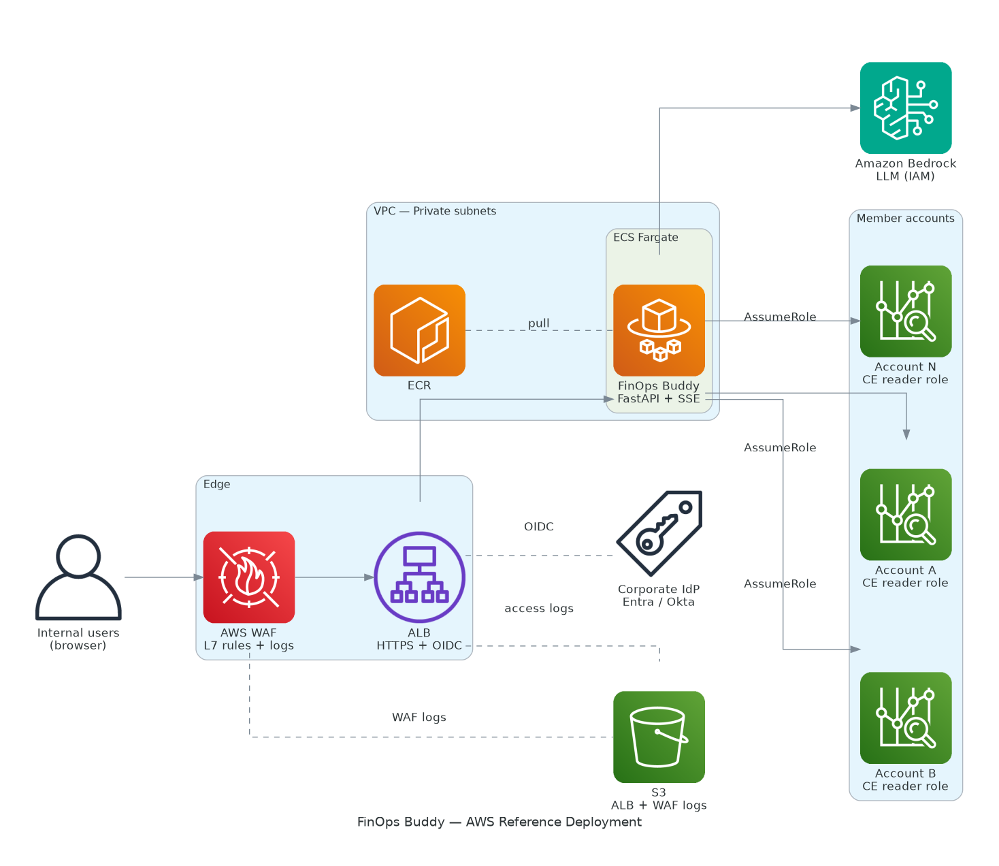
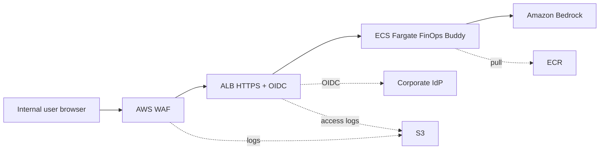
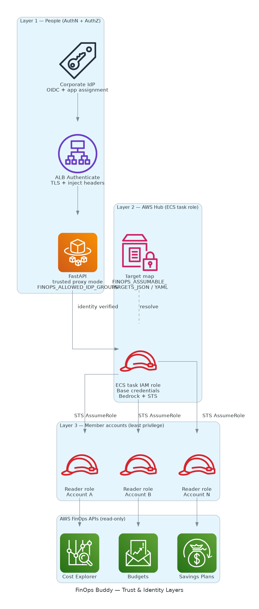
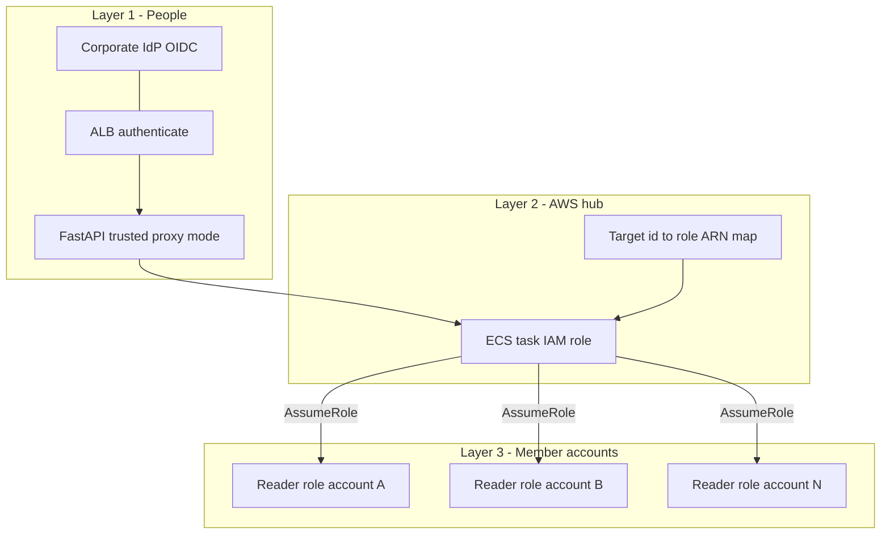

# FinOps Buddy — AWS reference deployment architecture

**Audience:** Platform / security / FinOps engineers  
**Source:** OpenSpec change `deploy-aws` (`openspec/changes/deploy-aws/proposal.md`, `design.md`)  
**Status:** Proposed (not yet implemented in application code)

This document describes the **standard AWS architecture** agreed for running **FinOps Buddy** when internal users reach the app over **public HTTPS** while the data plane remains **sensitive** (multi-account cost and FinOps APIs). It complements local and Docker workflows (`~/.aws` profiles); production uses **IAM roles** and **OIDC** instead.

---

## 1. Executive summary

| Area | Choice |
|------|--------|
| Compute | **Amazon ECS on Fargate** (long-lived process, agent/MCP warm-up, **SSE** streaming) |
| Edge | **AWS WAF** → **Application Load Balancer** (**HTTPS**, **OIDC** to corporate IdP) |
| Users | **Employees in browser**; **subset** via IdP app assignment + optional **group allowlist** in app |
| AWS data | **ECS task role** as hub; **STS AssumeRole** into **per-account FinOps reader** roles |
| LLM | **Amazon Bedrock** with **IAM** (preferred in production; model IDs are Bedrock-native, not OpenAI GPT names) |
| Compliance (v1) | **WAF logging**, **ALB access logs**, **application audit logs** (stable user id, no secrets) |

**Cognito** is intentionally **out of scope** for v1 when the IdP supports **OIDC** directly.

---

## 2. System context (diagram)

### 2.1 Edge, VPC runtime, Bedrock, and logging



*Figure: Traffic flow from browser through WAF and ALB (with OIDC to the corporate IdP) to ECS Fargate; Bedrock invocation via task role; AssumeRole fan-out to member-account Cost Explorer reader roles; ECR pull and log delivery to S3.*

### 2.2 Mermaid (for Markdown viewers that render Mermaid)



---

## 3. Identity and trust (diagram)

### 3.1 Three layers: people, application, AWS accounts



*Figure: Layer 1 — IdP + ALB + optional FastAPI checks (`FINOPS_TRUSTED_PROXY_AUTH`, `FINOPS_ALLOWED_IDP_GROUPS`). Layer 2 — task role + target map (`FINOPS_ASSUMABLE_TARGETS_JSON` / YAML). Layer 3 — member-account reader roles trusting the hub role.*

### 3.2 Mermaid



---

## 4. Key design decisions (from `design.md`)

| Decision | Why |
|----------|-----|
| **Fargate** | Fits streaming chat, warm-up, and WebSockets better than Lambda without a large refactor. |
| **ALB OIDC** | Standard integration with Entra / Okta / Google; fewer moving parts than Cognito for OIDC-first IdPs. |
| **WAF on ALB** | Layer-7 protection and logging for an internet-exposed admin-style application. |
| **Sticky sessions** (or single task initially) | **SSE** and long-lived connections need affinity when multiple tasks run. |
| **AssumeRole per account** | Aligns with least privilege and typical org SCP patterns; avoids one “god reader” unless policy allows. |
| **Feature flags (`FINOPS_*` + YAML)** | Local and Docker behavior stays default-off for cloud-only features. |

---

## 5. Configuration surface (planned)

Documented in OpenSpec `app-settings` delta; implementation will update **README** and **`config/settings.yaml`**.

| Variable / area | Purpose |
|-----------------|--------|
| `FINOPS_CLOUD_DEPLOYMENT_MODE` | Enable cloud credential chain + target map instead of profile files. |
| `FINOPS_ASSUMABLE_TARGETS_JSON` | JSON list mapping logical target ids to **role ARNs** (replaces YAML map when set). |
| `FINOPS_TRUSTED_PROXY_AUTH` | Require ALB-injected identity headers; reject otherwise. |
| `FINOPS_ALLOWED_IDP_GROUPS` | Optional comma-separated allowlist intersected with IdP **groups** claim. |
| `FINOPS_LLM_PROVIDER` | e.g. `bedrock` to force Bedrock even if an OpenAI key exists. |

Exact header names for OIDC claims SHALL be taken from **current AWS documentation** for ALB authenticate and mapped in one module during implementation.

---

## 6. Observability and compliance (v1)

| Signal | Use |
|--------|-----|
| **ALB access logs** | HTTP-level audit trail (URI, status, latency, source IP). |
| **WAF logs** | Block/allow decisions and rule matches. |
| **IdP sign-in logs** | Account lifecycle and MFA (outside this repo). |
| **Application logs** | Stable user identifier per allowed request; **never** log raw tokens or `Authorization` headers. |

---

## 7. Rollout and rollback (summary)

1. Ship application changes with **defaults off** (no change for existing users).  
2. Deploy **staging**: IaC, ACM, OIDC app registration, cross-account trust.  
3. Enable **trusted proxy auth** and optional group allowlist; validate **dashboard** and **SSE chat**.  
4. **Production**: tighten IdP assignment, confirm log retention.

**Rollback:** Turn off `FINOPS_TRUSTED_PROXY_AUTH`, scale service to zero, or break-glass ALB rule deny-all.

---

## 8. Diagram sources and PDF export

- **AWS Diagram MCP** (`generate_diagram`, Python `diagrams` package) generates the architecture diagrams with official AWS icons. Generated PNGs are under `docs/generated-diagrams/`. The original hand-authored SVGs are preserved under `docs/diagrams/` for reference.
- **PDF:** from the repo root run:

  ```bash
  poetry run python docs/build_deploy_architecture_pdf.py
  ```

  This uses **xhtml2pdf** (already in the project) so PDF generation works without WeasyPrint/GTK. On Linux/macOS with GTK installed, you may use **WeasyPrint** instead:

  ```bash
  FINOPS_USE_WEASYPRINT=1 poetry run python docs/build_deploy_architecture_pdf.py
  ```

  Output: `docs/DEPLOY_AWS_ARCHITECTURE.pdf`. Mermaid blocks in the Markdown are omitted from the PDF (SVG figures carry the same intent).

---

## 9. Related artifacts

| Artifact | Path |
|----------|------|
| Proposal | `openspec/changes/deploy-aws/proposal.md` |
| Design | `openspec/changes/deploy-aws/design.md` |
| Specs | `openspec/changes/deploy-aws/specs/` |
| Tasks | `openspec/changes/deploy-aws/tasks.md` |
| Suggested order (all cloud OpenSpec changes) | [CLOUD_CHANGES_WORK_ORDER.md](./CLOUD_CHANGES_WORK_ORDER.md) |

---

*Generated documentation aligned with the `deploy-aws` OpenSpec proposal. Implementation is tracked in `tasks.md`.*
