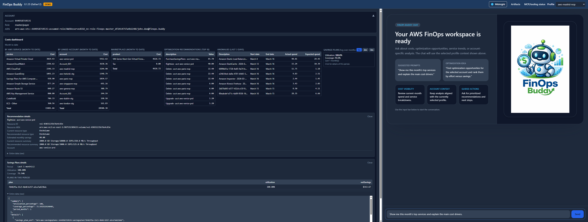
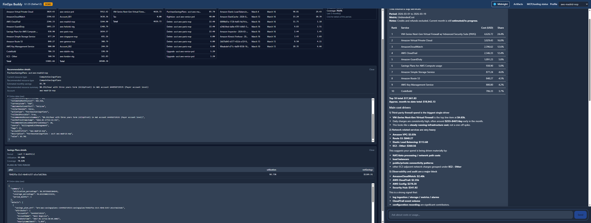
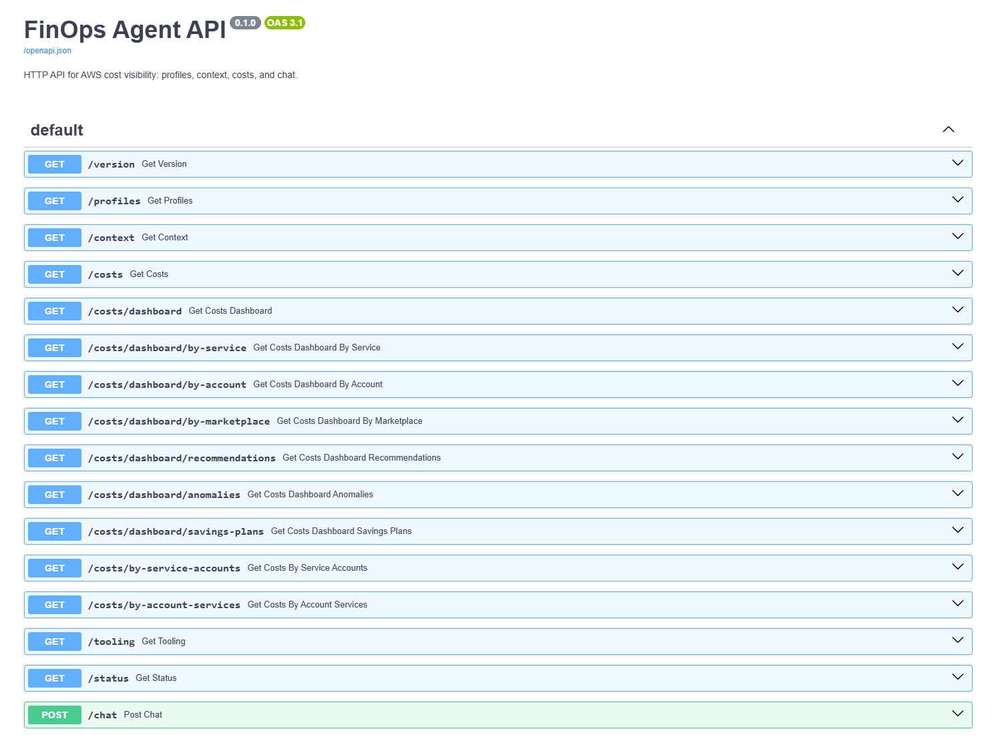

# Features and UI

Screenshots below show the **web UI** and **OpenAPI** surface. For how to run the app, see [Running FinOps Buddy](./RUNNING.md).

## Web UI



_Welcome screen, account context, costs dashboard (month to date), recommendations, anomalies, and savings plans._



_Chat workspace with cost analysis, top services, and the FinOps Buddy assistant._

## Backend API (OpenAPI)



_FastAPI OpenAPI documentation: profiles, context, costs, dashboard slices, tooling, status, and chat._

## What it does

**Web costs dashboard** — The hosted UI includes a structured **costs dashboard** (aligned with AWS Cost Explorer) for the selected AWS profile. It shows **month-to-date** spend grouped **by AWS service** (AWS-only, excluding Marketplace), **by linked account** (with friendly names where resolvable), and **Marketplace** usage. You can click rows to drill into **per-account service breakdown** or **per-service account breakdown**. The same panel surfaces **top cost optimization recommendations**, **Cost Anomaly Detection** anomalies (recent window), and **Savings Plans** utilization and coverage (with optional per-plan detail). Account identity (account ID, ARN, role) is summarized at the top so you always know which context you are viewing.

**Conversational assistant** — Alongside the dashboard, FinOps Buddy gives you a chat interface to explore AWS costs across multiple accounts. Ask questions like "What's driving my EC2 costs this month?" or "Compare spend between prod and staging" — the AI agent queries AWS APIs (and MCP tools where configured), analyzes the data, and explains findings in plain English.

The application is **intentionally read-only**: it helps you investigate and understand, but never modifies your AWS resources. This makes it safe to use with production credentials.

## Key features

- **Costs dashboard (web UI)** — Month-to-date tables by service, linked account, and Marketplace; drill-downs; recommendations, anomalies, and Savings Plans summaries
- **Multi-account cost analysis** — Switch between AWS profiles and compare costs across accounts
- **Natural language queries** — Ask questions in plain English; the AI translates to API calls
- **Real-time streaming responses** — Server-Sent Events deliver answers as they're generated
- **Chart generation** — The agent can generate line, bar, pie, and scatter charts from cost data using **matplotlib**; all rendering is local (no external services)
- **Artifacts basket** — In the web UI, generated charts are collected in an **Artifacts** basket in the header; you can preview and download them as PNG files
- **Extensible via MCP servers** — Plug in AWS documentation, pricing data, and more ([MCP servers](./MCP.md))
- **Safe by default** — Read-only guardrails prevent any mutating operations

## Demo mode

For presentations and portfolio demos, FinOps Buddy supports a **demo mode** that masks real AWS account names, profile names, and account IDs with fake/placeholder values.

### How to access demo mode

Navigate to `/demo` instead of `/` in the web UI:

- Normal mode: `http://localhost:8000/`
- Demo mode: `http://localhost:8000/demo`

When demo mode is active:

- A **DEMO** badge appears in the header
- Profile names are replaced with fake city-based names (e.g., `aws-tokyo-prd`, `aws-london-stg`)
- Account IDs are replaced with random 12-digit IDs
- The chat agent uses fake names in its responses

### Generating demo config

Run the following command to auto-generate `config/demo.yaml` from your `~/.aws/config`:

```bash
poetry run finops demo-config
```

This reads your AWS profiles and generates mappings with:

- **Account names**: city-based names in format `aws-{city}-{prd|nop|stg}`
- **Account IDs**: random 12-digit numbers

The generated `config/demo.yaml` is gitignored to avoid committing real profile names.

**Example output:**

```yaml
account_mapping:
  my-prod-profile: aws-tokyo-prd
  my-staging-profile: aws-london-stg
  my-dev-profile: aws-paris-nop
account_id_mapping:
  "123456789012": "847291038572"
  "987654321098": "293847561029"
```
