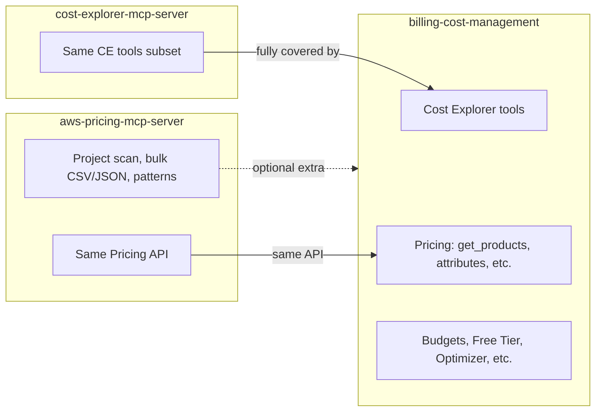

# MCP Servers Overlap: Billing, Cost Explorer, and AWS Pricing

This document records the analysis of tool overlap among three AWS MCP servers and the project decisions for which to implement. It serves as **reasoning and justification** for future reference.

---

## Decisions (summary)

| Decision | Choice | Rationale |
|----------|--------|-----------|
| **Cost Explorer MCP server** | **Do not implement** | Its tool set is fully subsumed by `billing-cost-management-mcp-server`. Enabling it would duplicate Cost Explorer tools and add an extra process with no functional benefit. |
| **AWS Pricing MCP server** | **Implement** | We use it for its **extra** capabilities: bulk pricing (CSV/JSON), CDK/Terraform project analysis for cost estimation, and architecture/cost-pattern guidance. BCM covers only core Pricing API (get_products, attributes); the pricing MCP adds value beyond that. |
| **Billing and Cost Management MCP server** | **Already implemented** | Single server for Cost Explorer, core pricing, budgets, anomalies, optimizer, RI/SP, etc. |

---

## 1. What each server exposes

### billing-cost-management-mcp-server (BCM)

From the [BCM README](https://github.com/awslabs/mcp/blob/main/src/billing-cost-management-mcp-server/README.md):

- **Cost Explorer**: `get_cost_and_usage`, `get_cost_and_usage_with_resources`, `get_dimension_values`, `get_cost_forecast`, `get_usage_forecast`, `get_cost_and_usage_comparisons`, `get_cost_comparison_drivers`, `get_anomalies`, `get_tags`, `get_cost_categories`, plus RI/SP: `get_reservation_*`, `get_savings_plans_*`
- **AWS Pricing**: `get_service_codes`, `get_service_attributes`, `get_attribute_values`, `get_products`
- **Other**: Budgets, Free Tier, Cost Optimization Hub, Compute Optimizer, BCM Pricing Calculator, Storage Lens, Billing Conductor, and prompts (e.g. Graviton, Savings Plans)

### cost-explorer-mcp-server (CE)

From the [Cost Explorer README](https://github.com/awslabs/mcp/blob/main/src/cost-explorer-mcp-server/README.md):

- `get_today_date`, `get_dimension_values`, `get_tag_values`, `get_cost_and_usage`, `get_cost_and_usage_comparisons`, `get_cost_comparison_drivers`, `get_cost_forecast`

### aws-pricing-mcp-server (Pricing)

From the [AWS Pricing README](https://github.com/awslabs/mcp/blob/main/src/aws-pricing-mcp-server/README.md):

- Pricing API: service catalog, attribute discovery, real-time pricing, multi-region comparison, **bulk pricing (CSV/JSON)**
- **Extra**: CDK/Terraform project analysis, architecture pattern guidance, cost optimization recommendations (Well-Architected style). **Pricing API calls are free.**

---

## 2. Overlap map

| Capability | BCM | Cost Explorer MCP | AWS Pricing MCP |
|------------|-----|-------------------|-----------------|
| Cost Explorer (usage, forecast, comparisons, drivers) | Yes (full) | Yes (subset) | No |
| Dimension/tag values | Yes | Yes | No |
| RI / Savings Plans | Yes | No | No |
| Pricing API (products, attributes) | Yes | No | Yes |
| Budgets, anomalies, optimizer, etc. | Yes | No | No |
| Bulk pricing (CSV/JSON) | No | No | Yes |
| CDK/Terraform project analysis | No | No | Yes |
| Architecture / cost patterns | No | No | Yes |

---

## 3. Why not implement Cost Explorer MCP server

- Every tool provided by **cost-explorer-mcp-server** is already provided by **billing-cost-management-mcp-server** (same or broader Cost Explorer surface).
- Enabling both would:
  - Duplicate tools (e.g. `get_cost_and_usage`, `get_cost_forecast`) and risk confusion or duplicate calls.
  - Add a second process and configuration without adding capability.
- The only hypothetical reason to run Cost Explorer MCP alone would be a “lighter” Cost-Explorer-only setup; for this project we already run BCM, so that case does not apply.

**Conclusion:** We do **not** implement or enable `awslabs.cost-explorer-mcp-server`. BCM is the single source for Cost Explorer–style tools.

---

## 4. Why we implement AWS Pricing MCP server

- BCM covers **core** Pricing API (get_products, get_attribute_values, service codes, etc.).
- **aws-pricing-mcp-server** adds:
  - **Bulk pricing export** (CSV/JSON) for offline or historical analysis.
  - **CDK/Terraform project analysis** for cost estimation from infrastructure code.
  - **Architecture and cost-pattern guidance** (e.g. Well-Architected–aligned).
- Pricing API calls are **free**; running both BCM and the pricing MCP does not increase API cost, and the agent can use the pricing server for these extras while using BCM for cost/usage and optimization.

**Conclusion:** We **do** implement and enable `awslabs.aws-pricing-mcp-server` for the above extras. Overlap with BCM on core pricing is acceptable; the additional tools justify a separate server.

---

## 5. Alignment with this project

- The codebase uses a single Billing MCP: `DEFAULT_BILLING_MCP_PACKAGE = "awslabs.billing-cost-management-mcp-server@latest"` in `src/finops_agent/settings.py`.
- `openspec/docs/PROJECT_CONTEXT.md` lists BCM, cost-explorer, and aws-pricing as MCPs to “use”; that is interpreted as **available options**, not “all three required.”
- **Final stance:** Use **BCM only** for Cost Explorer and core pricing; **do not** add cost-explorer MCP; **add** aws-pricing MCP when implementing pricing-related features that need bulk export, project scanning, or pattern guidance.

---

## 6. Cost and process notes

- **Cost Explorer API:** BCM (and the Cost Explorer MCP) call the Cost Explorer API; each request is billable (e.g. $0.01). Running BCM alone vs BCM + Cost Explorer MCP does not change that; what matters is how many Cost Explorer calls the agent makes.
- **Pricing API:** Free. Using BCM for pricing and adding aws-pricing MCP does not add API cost.
- **Processes:** One BCM process plus one aws-pricing MCP process is the target; we avoid a third (cost-explorer) process as redundant.
